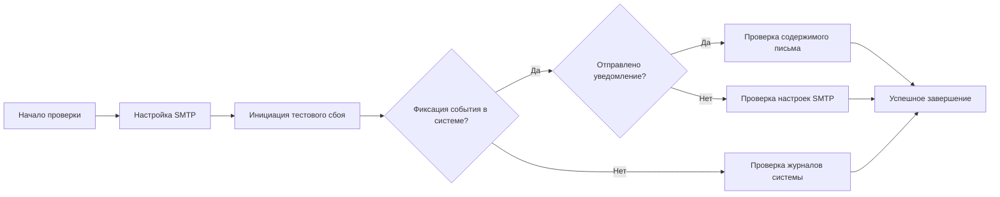

## 📋 Методика испытаний: Уведомление по электронной почте о сбоях и ошибках SIEM

### 1. Объект испытаний
Подсистема мониторинга состояния и отправки уведомлений MaxPatrol SIEM.

### 2. Цель проверки
Подтверждение корректности настройки и функционирования механизма отправки уведомлений на электронную почту при возникновении критических ошибок, сбоев в работе компонентов системы и проблем с получением данных от источников событий.

### 3. Предварительные условия
1.  В системе MaxPatrol SIEM настроен SMTP-сервер для отправки уведомлений 【turn0search10】.
2.  В разделе **Система → Мониторинг обработки событий** доступны данные о состоянии конвейеров и источников событий 【turn0search14】.
3.  В системе включен автоматический мониторинг параметров жизнеспособности и целостности системы и ее компонентов 【turn0search5】.

### 4. Сценарии тестирования

#### Сценарий 1: Уведомление об ошибке получения данных от источника событий
**Основание:** Система может не получать данные от задач из-за ошибок в работе компонентов, неправильной настройки профиля для сбора данных или сбоев в работе источника событий 【turn0search13】.

| Действие (шаги) | Ожидаемый результат |
| :--- | :--- |
| 1. В веб-интерфейсе перейти в **Система → Мониторинг обработки событий**. | Открылся раздел мониторинга, отображается состояние конвейеров и задач. |
| 2. Инициировать тестовый сбой: остановить коллектор или отключить тестовый источник событий, от которого должна поступать информация. | В интерфейсе мониторинга (в течение заданного интервала) зафиксирована ошибка или отсутствие данных от соответствующего источника. |
| 3. Проверить раздел **События** на предмет появления системного события об ошибке. | В списке событий присутствует событие типа «Ошибка получения данных» или аналогичное, связанное с тестовым источником 【turn0search14】. |
| 4. Проверить указанный при настройке SMTP почтовый ящик. | Получено электронное письмо от системы MaxPatrol SIEM с темой, указывающей на ошибку или сбой в работе источника. |
| 5. Проверить содержимое письма. | В письме содержится информация о характере ошибки, времени возникновения и, возможно, рекомендации по устранению 【turn0search10】. |

#### Сценарий 2: Уведомление о критической ошибке компонента системы
**Основание:** MaxPatrol SIEM реализует автоматический мониторинг параметров жизнеспособности и целостности системы и ее компонентов 【turn0search5】.

| Действие (шаги) | Ожидаемый результат |
| :--- | :--- |
| 1. Смоделировать критическую ситуацию: исчерпать свободное место на диске, где хранятся события, или остановить ключевой сервис (например, `mp-siem-server`). | В системе зарегистрировано критическое событие, отражающее проблему (например, «Нет места на диске», «Сервис остановлен»). |
| 2. Перейти в раздел **События** и найти соответствующее системное событие. | Событие отображается с высоким приоритетом/критичностью. |
| 3. Проверить почтовый ящик, указанный для системных уведомлений. | Получено уведомление по электронной почте с информацией о критическом сбое в работе компонента SIEM. |
| 4. Убедиться, что в письме указаны: время, описание ошибки, затронутый компонент. | Содержимое письма позволяет идентифицировать проблему и приступить к ее решению. |

#### Сценарий 3: Проверка настройки и доступности SMTP-сервера
**Основание:** Для отправки уведомлений необходимо корректно указать параметры SMTP-сервера 【turn0search10】.

| Действие (шаги) | Ожидаемый результат |
| :--- | :--- |
| 1. Перейти в раздел настроек SMTP-сервера для уведомлений. | Открылась форма с полями для указания адреса сервера, порта, аутентификации и т.д. 【turn0search10】. |
| 2. Ввести некорректные данные (например, неверный адрес сервера или порта) и сохранить настройки. | При попытке отправить тестовое уведомление система выдает ошибку соединения или аутентификации. |
| 3. Ввести корректные данные и сохранить настройки. | Система успешно соединяется с SMTP-сервером и отправляет тестовое письмо на указанный адрес. |
| 4. Проверить почтовый ящик. | Тестовое письмо от MaxPatrol SIEM получено, что подтверждает корректность настроек. |

### 5. Критерии приемки
Испытания считаются пройденными успешно, если:
1.  При возникновении регистрируемых системой ошибок и сбоев (например, отсутствие данных от источника 【turn0search14】, критическая ошибка компонента 【turn0search5】) на настроенный электронный адрес отправляются уведомления.
2.  Содержимое уведомлений позволяет однозначно идентифицировать проблему: содержит описание ошибки, время возникновения и, по возможности, затронутый компонент.
3.  Тестовая отправка письма через настройки SMTP завершается успешно при корректных параметрах 【turn0search10】.
4.  Системные события, связанные с мониторингом состояния, корректно отображаются в интерфейсе MaxPatrol SIEM 【turn0search5】【turn0search14】.

### 6. Ссылки на официальную документацию
1.  **Настройка SMTP-сервера для отправки уведомлений по электронной почте** — основной раздел по настройке уведомлений 【turn0search10】.
2.  **Мониторинг состояния MaxPatrol SIEM** — описание встроенного механизма мониторинга жизнеспособности системы 【turn0search5】.
3.  **Система не получает данные от задачи** — примеры возможных ошибок и их диагностика 【turn0search13】.
4.  **Отсутствуют события от источников** — раздел, посвященный диагностике проблем с получением событий 【turn0search14】.

<b>🔧 Технические детали реализации мониторинга</b>

Согласно документации, MaxPatrol SIEM имеет встроенный механизм мониторинга, который может отслеживать:
*   Доступность и производительность компонентов системы.
*   Целостность и работоспособность баз данных.
*   Наличие свободного дискового пространства.
*   Статус задач по сбору событий.

События, генерируемые этим механизмом, доступны для просмотра в интерфейсе и могут быть использованы для отправки уведомлений. Для их корректной работы необходимо, чтобы в системе были настроены правила, которые на основе этих системных событий инициируют отправку уведомлений через настроенный SMTP-канал 【turn0search5】【turn0search10】.

